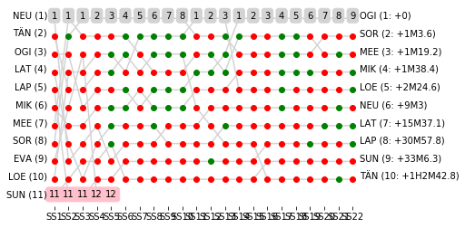

# Rally Report - Mexico

*This report is unofficial and is not associated in any way with the Fédération Internationale de l’Automobile (FIA) or WRC Promoter GmbH.*

Rally Guanajuato México (2018-03-08 to 2018-03-11) runs over 22 competitive special stages. The distance covered on the special stages is 344.49km, with an overall rally distance of 1055.88km. The special stage surface type is predominantly Gravel.

