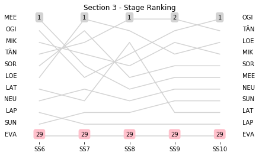
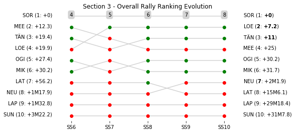

# Section 3, Friday 9 March

This section comprises five special stages (SS6 - Duarte - Derramadero 2 (26.05km), SS7 - El Chocolate 2 (31.44km), SS8 - Ortega 2 (17.23km), SS9 - Autodromo de Leon 1 (2.3km), SS10 - Autodromo de Leon 2 (2.3km))

The full scheduled itinerary for the section was as follows:

	- 14:42:00 TC5B Regroup OUT-Service B IN  [00:20:00]
	- 15:12:00 TC5C Service B OUT  [00:30:00]
	- 15:57:00 TC6 Las Coloradas (30.08km) [00:45:00]
	- 16:00:00 SS6 Duarte - Derramadero 2 (26.05km) [00:03:00]
	- 16:45:00 TC7 Cuestecita (11.69km) [00:45:00]
	- 16:48:00 SS7 El Chocolate 2 (31.44km) [00:03:00]
	- 17:38:00 TC8 El Zorrillo (7.33km) [00:50:00]
	- 17:41:00 SS8 Ortega 2 (17.23km) [00:03:00]
	- 19:26:00 TC8A LFZ IN (53.96km) [01:45:00]
	- 19:41:00 TC8B LFZ OUT  [00:15:00]
	- 19:46:00 TC9 Autodromo de Leon (1.22km) [00:05:00]
	- 20:06:00 SS9 Autodromo de Leon 1 (2.3km) [00:20:00]
	- 20:11:00 SS10 Autodromo de Leon 2 (2.3km) [00:05:00]
	- 21:26:00 TC10A Technical Zone IN-Parc Ferme IN (14.92km) [01:15:00]
	- 00:00:00 TC10C Flexi Service C OUT-Parc Ferme IN  [02:34:00]

### Section 3 Report
Section 3

Section 3

