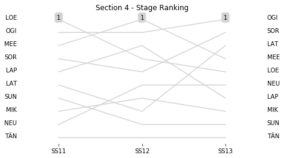

# Section 4, Saturday 10 March

This section comprises three special stages (SS11 - Guanajuatito 1 (30.97km), SS12 - Otates 1 (26.37km), SS13 - El Brinco 1 (9.98km))

The full scheduled itinerary for the section was as follows:

	- 07:30:00 TC10D Overnight Regroup OUT-Service D IN  [00:00:00]
	- 07:45:00 TC10E Service D OUT  [00:15:00]
	- 08:30:00 TC11 Guanajuatito (27.43km) [00:45:00]
	- 08:33:00 SS11 Guanajuatito 1 (30.97km) [00:03:00]
	- 10:08:00 TC12 Sauz Seco (29.45km) [01:35:00]
	- 10:11:00 SS12 Otates 1 (26.37km) [00:03:00]
	- 10:51:00 TC13 La Estancia (8.33km) [00:40:00]
	- 11:08:00 SS13 El Brinco 1 (9.98km) [00:17:00]
	- 12:28:00 TC13A Technical Zone IN-Regroup IN (31.83km) [01:20:00]

### Section 4 Report
Section 4

Section 4

