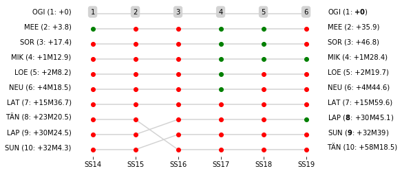

### Section 5 Report

Saturday 10 March, 12:48:00 TC13B Regroup OUT-Service E IN  [00:20:00]

Saturday 10 March, 13:18:00 TC13C Service E OUT  [00:30:00]

Saturday 10 March, 14:18:00 TC14 Guanajuatito (27.43km) [01:00:00]

Saturday 10 March, 14:21:00 SS14 Guanajuatito 2 (30.97km) [00:03:00]

Saturday 10 March, 16:11:00 TC15 Sauz Seco (29.45km) [01:50:00]

Saturday 10 March, 16:14:00 SS15 Otates 2 (26.37km) [00:03:00]

Saturday 10 March, 16:49:00 TC16 La Estancia (8.33km) [00:35:00]

Saturday 10 March, 16:58:00 SS16 El Brinco 2 (9.98km) [00:09:00]

Saturday 10 March, 17:38:00 TC17 Autodromo de Leon (21.88km) [00:40:00]

Saturday 10 March, 17:58:00 SS17 Autodromo de Leon 3 (2.3km) [00:20:00]

Saturday 10 March, 18:03:00 SS18 Autodromo de Leon 4 (2.3km) [00:05:00]

Saturday 10 March, 18:53:00 TC18A Technical Zone IN-Parc Ferme IN (14.92km) [00:50:00]

Saturday 10 March, 20:38:00 TC18D Parc Ferme OUT  [01:45:00]

Saturday 10 March, 20:43:00 TC19 Rally Campus Leon (0.1km) [00:05:00]

Saturday 10 March, 20:46:00 SS19 Street Stage Leon 2 (1.11km) [00:03:00]

Saturday 10 March, 20:56:00 TC19A Overnight Regroup IN (1.05km) [00:10:00]### Section 5 Report
Section 5

