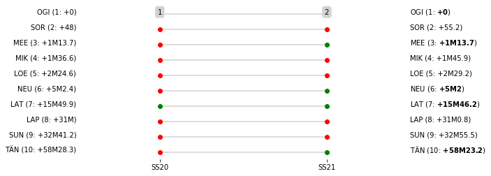

### Section 6 Report

Sunday 11 March, 07:15:00 TC19B Overnight Regroup OUT-Service G IN  [00:00:00]

Sunday 11 March, 07:30:00 TC19C Service G OUT  [00:15:00]

Sunday 11 March, 08:15:00 TC20 Sauz Seco (21.03km) [00:45:00]

Sunday 11 March, 08:18:00 SS20 Alfaro (24.32km) [00:03:00]

Sunday 11 March, 10:05:00 TC21 San Nicolas (71.88km) [01:47:00]

Sunday 11 March, 10:08:00 SS21 Las Minas (11.07km) [00:03:00]

Sunday 11 March, 10:23:00 TC21A Guanajuato Regroup IN-Technical Zone IN (0.35km) [00:15:00]### Section 6 Report
Section 6

