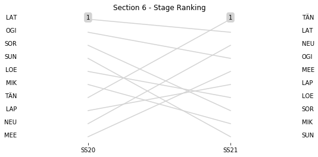
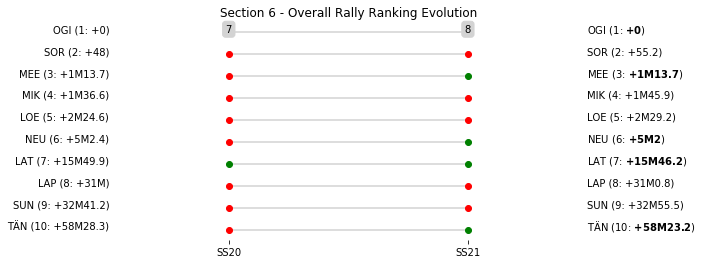

# Section 6, Sunday 11 March

This section comprises two special stages (SS20 - Alfaro (24.32km), SS21 - Las Minas (11.07km))

The full scheduled itinerary for the section was as follows:

	- 07:15:00 TC19B Overnight Regroup OUT-Service G IN  [00:00:00]
	- 07:30:00 TC19C Service G OUT  [00:15:00]
	- 08:15:00 TC20 Sauz Seco (21.03km) [00:45:00]
	- 08:18:00 SS20 Alfaro (24.32km) [00:03:00]
	- 10:05:00 TC21 San Nicolas (71.88km) [01:47:00]
	- 10:08:00 SS21 Las Minas (11.07km) [00:03:00]
	- 10:23:00 TC21A Guanajuato Regroup IN-Technical Zone IN (0.35km) [00:15:00]

### Section 6 Report
Section 6

Section 6

